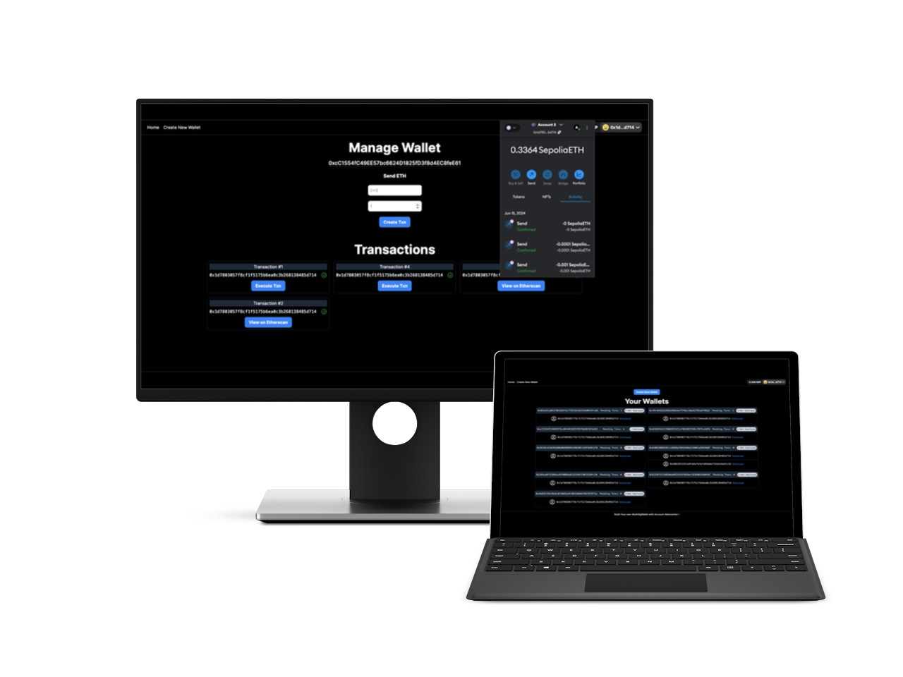

# Smart Contract Wallet (SCW) Project

website link-[multi-wallet-beta.vercel.app/](https://multi-wallet-beta.vercel.app/)

Welcome to the Smart Contract Wallet (SCW) project! This project is designed to implement account abstraction through a multi-signature wallet smart contract.

## Table Of Contents
- Overview
- Creating a New Wallet
- Features
- Technologies Used
- Setup and Installation
- License

## Overview
The Smart Contract Wallet (SCW) project leverages account abstraction to create a multi-signature wallet smart contract. This enables users to securely manage their assets with multiple signers required to authorize transactions. The project is built using Ethereum smart contracts and interacts with a web frontend using Next.js.

## Creating a New Wallet
Connect your Ethereum wallet (MetaMask recommended).
Navigate to the "Create New Wallet" page.
Add signers by entering their Ethereum addresses.
Submit the form to create a new wallet. The wallet address will be displayed upon successful creation.

### Interacting with the Wallet
View your wallets on the homepage.
Select a wallet to view details and manage assets.
Propose and approve transactions with multiple signers.

## Features
Account Abstraction: Implemented using the ERC-4337 standard.
Multi-Signature Wallet: Requires multiple signers to authorize transactions.
Smart Contract Interaction: Utilizes ethers.js for seamless smart contract interaction.
User-Friendly Interface: Built with Next.js and RainbowKit for a modern web experience.
Secure and Scalable: Ensures security and scalability for managing assets on the Ethereum blockchain.

## Technologies Used
Smart Contracts: Solidity, OpenZeppelin
Web3 Library: ethers.js
Framework: Next.js
Styling: TailwindCSS
Database: Prisma
API Integration: userop, wagmi, RainbowKit
Ethereum Testnet: Sepolia

## Setup and Installation
- git clone [https://github.com/Smr0303/MultiWallet.git](https://github.com/Smr0303/MultiWallet.git)
- cd MultiWallet
- npm install
### create .env file and add the variables:
- NEXT_PUBLIC_WALLET_CONNECT_PROJECT_ID=YOUR_PROJECT_ID
- BUNDLER_RPC_URL=https://eth-sepolia.g.alchemy.com/v2/YOUR_ALCHEMY_API_KEY
- WALLET_FACTORY_ADDRESS=YOUR_WALLET_FACTORY_CONTRACT_ADDRESS
### Run the development server:
- npm run dev
- Open http://localhost:3000 in your browser

### License
This project is licensed under the GPL-3.0
